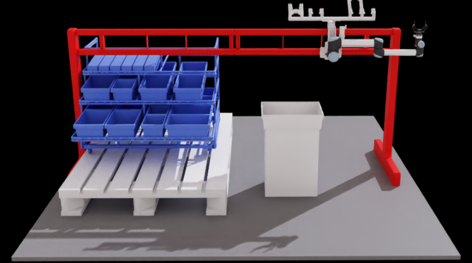

# Generative AI-based Robotic Kitting System

<p align="center">
  
</p>

A neuro-symbolic framework that turns natural-language operator
commands ("pick all motor valves") into safe robot motion. The system
combines:

- **Vision-Language Models (VLMs)** — Qwen2.5-VL / Qwen3-VL / Gemma4
  for zero-shot scene understanding.
- **Zero-shot object detectors** — OWL-ViT2 or Grounding DINO for
  precise per-part bounding boxes.
- **Large Language Models (LLMs)** — Gemma4 / Llama-class models for task
  planning (constrained to a fixed action vocabulary).
- **NVIDIA Isaac Sim** — UR10 arm with a Robotiq 2F-140 gripper on a
  gantry rail, controlled deterministically via a Lula IK solver.

The VLM never drives the robot directly; it only emits validated
action primitives (`pick_object`, `place_object`, `move_home`, …).
Execution is fully deterministic.

---

## Architecture

```
Operator command
       │
       ▼
┌───────────────┐    ┌────────────────┐    ┌────────────────┐
│  Perception   │ →  │ Orchestration  │ →  │   Execution    │
│ (VLM + OWL)   │    │   (VLM/LLM)    │    │ (Isaac Sim)    │
└───────────────┘    └────────────────┘    └────────────────┘
   scene JSON          task plan            joint motion
```

## Demo

Gear grasping in Isaac Sim:

https://github.com/user-attachments/assets/ce842b65-8fff-49ce-ba43-e309332c6cd6

---

## Prerequisites

| Component | Version / Notes |
|---|---|
| Python | 3.9 or newer (3.10+ recommended) |
| NVIDIA Isaac Sim | 5.1.0 (only for simulator-attached runs) |
| Ollama | Any recent version (local or remote) |
| OS | Windows / Linux (paths are resolved cross-platform) |
| GPU | NVIDIA RTX 4070 or above with minimum 24GB VRAM |

You can run the standalone CLI / Streamlit UI **without** Isaac Sim
using `--mock-image`. Isaac Sim is only needed when you want the robot
to actually move.

---

## 1. Clone

```bash
git clone <your-fork-url> robot_in_air
cd robot_in_air
```

The repository ships with the USD scene (`AIKIDO.usd`), config, source
code, and an example environment file. There is no submodule step.

---

## 2. Configure environment

All machine-specific values (model server URL, Isaac Sim install path,
API keys, bridge bind host) are read from environment variables, so
you can run the project on any machine without editing the source.

Copy the template and fill in what applies to you:

```bash
cp .env.example .env
```

Open `.env` and pick **one of the two options** for the model server:

### Option A — Local Ollama (recommended, no VPN required)

1. Install Ollama on your own machine: <https://ollama.com/download>
2. Pull the models you want to use:
   ```bash
   ollama pull gemma4:e4b          # VLM for perception
   ollama pull llama3.1:8b         # LLM for planning
   # Optional larger / alternative models:
   # ollama pull qwen3-vl:8b
   ```
3. Start the Ollama daemon (default port 11434):
   ```bash
   ollama serve
   ```
4. Leave `OLLAMA_BASE_URL` in `.env` set to the localhost default — no
   change needed:
   ```env
   OLLAMA_BASE_URL=http://localhost:11434
   ```

### Option B — Remote / VPN Ollama server

If your lab runs a shared GPU box, point at it directly:

```env
OLLAMA_BASE_URL=http://<your-server-host>:11434
```

The Streamlit dashboard's model dropdown will list whatever models are
loaded on whichever server `OLLAMA_BASE_URL` resolves to at startup.

### Other env vars

```env
# Loopback by default — change only if you knowingly want LAN clients
# to call /api/execute on the Isaac Sim bridge (the bridge has no auth).
BRIDGE_HOST=127.0.0.1
BRIDGE_PORT=8600

# Required only when you want to run the simulator-attached bridge.
# Set to the directory containing Isaac Sim's `exts/` folder.
#   Windows : %LOCALAPPDATA%\ov\pkg\isaac-sim-<ver>
#   Linux   : ~/.local/share/ov/pkg/isaac-sim-<ver>
ISAACSIM_PATH=

# Only needed for OpenAI / cloud VLM providers; leave blank with Ollama.
OPENAI_API_KEY=
```

`PROJECT_ROOT` is auto-detected from the file tree, so you don't have
to set it.

---

## 3. Install Python dependencies

A virtual environment named `.aikido` is the project convention. The
launcher scripts will create it for you on first run; or do it
manually:

```bash
python -m venv .aikido
# Windows:
.aikido\Scripts\activate
# Linux / macOS:
source .aikido/bin/activate

pip install --upgrade pip
pip install -r generative_kitting/requirements.txt
```

Key packages: `streamlit`, `transformers`, `torch`, `ollama`, `openai`,
`pillow`, `pyyaml`, `loguru`, `pydantic`, `pytest`.

---

## 4. Run

The project has four entry points. Pick the one that matches what you
want to do.

### A. Streamlit operator dashboard (most common)

Live overhead + wrist camera, VLM / detector overlays, chat command
interface, execution logs. Connects to Isaac Sim if the bridge is
running; otherwise falls back to mock images.

```bash
# From repo root (after activating the venv)
python generative_kitting/main.py --ui
```

…or use the launcher scripts which also create / refresh the venv:

```bash
# Windows
generative_kitting\run_ui.bat

# Linux / macOS
generative_kitting/run_ui.sh
```

The UI will open at <http://localhost:8501>.

### B. Headless CLI

Run a single command and exit (mostly useful for benchmarking and
batch evaluation):

```bash
python generative_kitting/main.py -c "Pick all motor valves"
```

Interactive REPL:

```bash
python generative_kitting/main.py
```

### C. Run against a mock image (no Isaac Sim, no live camera)

```bash
python generative_kitting/main.py --mock-image path/to/workspace.png
```

Useful for testing perception + planning end-to-end on a fixed scene.

### D. Connect to Isaac Sim (full pipeline with real robot motion)

1. Open Isaac Sim and load `AIKIDO.usd`.
2. Tell the bridge launcher where your repo lives. Pick **one**:
   - **Env-var approach** (recommended): set `KITTING_PROJECT_ROOT`
     to your repo root **before** launching Isaac Sim, e.g.
     ```powershell
     # Windows PowerShell — run this in the same shell you'll use
     # to launch isaac-sim.bat
     $env:KITTING_PROJECT_ROOT = "C:/path/to/robot_in_air"
     ```
     ```bash
     # Linux / macOS
     export KITTING_PROJECT_ROOT="$HOME/code/robot_in_air"
     ```
   - **Edit-one-line approach**: open
     `generative_kitting/kitting_bridge_server.py` and set the
     `PROJECT_ROOT` constant near the top of the file to your repo's
     absolute path. This is needed because Isaac Sim's Script Editor
     copies scripts to a Temp folder before running them, so
     `__file__` inside the launcher does **not** point at the
     original file.
3. In Isaac Sim open **Script Editor** (`Window → Script Editor`),
   open `generative_kitting/kitting_bridge_server.py`, and click
   **Run**.
4. You should see `[OK] Bridge v2 on http://127.0.0.1:8600` in the
   Isaac Sim console.
5. In another terminal, launch the Streamlit UI (option A above). It
   will detect the bridge automatically.

The bridge exposes a small HTTP API (`/api/ping`, `/api/status`,
`/api/camera`, `/api/execute`, `/api/pick`, `/api/place`, …) on port
8600. It binds to loopback by default; change `BRIDGE_HOST` only if
you knowingly want LAN access (there is no authentication).

---

## 5. Seed / reset the parts database

The parts database (`generative_kitting/knowledge/kitting.db`) is
auto-seeded on first run. To re-seed manually:

```bash
python generative_kitting/main.py --seed-db
```

Edit the catalogue in
[`generative_kitting/knowledge/parts_catalogue.yaml`](generative_kitting/knowledge/parts_catalogue.yaml)
to add / remove part types. The catalogue is the single source of
truth — no code changes required when you add a part.

---

## 6. Tests

```bash
cd generative_kitting
python -m pytest tests/ -v
```

The test suite covers planner validation, controller safety, plan
execution paths, and perception schema checks. No Isaac Sim
connection is required — everything is mocked.

---

## Project layout

```
robot_in_air/
├── .env.example              # template for local environment vars
├── .gitignore                # files and folders to ignore
├── AIKIDO.usd                # main Isaac Sim scene
├── README.md                 # this file
├── usd_meshes                # other usd meshes
├── resources                 # image and video clip of the simulation
├── generative_kitting/       # main Python package
│   ├── config.yaml           # central configuration (env-var aware)
│   ├── main.py               # CLI / UI entry point
│   ├── isaac_sim_bridge.py   # HTTP bridge run inside Isaac Sim
│   ├── kitting_bridge_server.py   # one-line bridge launcher
│   ├── requirements.txt
│   ├── perception/           # VLM + zero-shot detector + camera
│   ├── orchestration/        # LLM planner + validators + workflow
│   ├── execution/            # robot controller + motion + safety
│   ├── knowledge/            # parts DB + catalogue
│   ├── ui/streamlit_app.py   # operator dashboard
│   ├── utils/config_loader.py  # env-aware YAML loader
│   └── tests/                # pytest suite
└── src/robot_control.py      # legacy monolithic control script
```

---

## Security notes

- The Isaac Sim bridge and the optional detector server bind to
  loopback (`127.0.0.1`) by default. They expose endpoints that move
  the physical / simulated robot and have **no authentication** —
  only set `BRIDGE_HOST` / `--host` to `0.0.0.0` when you control the
  network you're on.
- API keys, server IPs, and install paths are loaded from environment
  variables, not committed to the repo. `.env` is gitignored.
- Don't commit `eval.db`, captured camera frames, or session logs —
  they live under `generative_kitting/logs/` and may contain workspace
  imagery.

---

## Troubleshooting

| Symptom | Likely cause / fix |
|---|---|
| `Cannot reach Ollama` on startup | `ollama serve` not running, or `OLLAMA_BASE_URL` points at the wrong host. |
| Bridge log says `[OK] Bridge v2 on http://127.0.0.1:8600` but Streamlit can't connect | Firewall on your machine — or you're running Streamlit in a container that can't reach loopback. Set `BRIDGE_HOST=0.0.0.0` only as a last resort. |
| `URDF / YAML not found` when initialising IK | `ISAACSIM_PATH` is unset or points at the wrong folder. It must contain `exts/isaacsim.asset.importer.urdf/`. |
| Streamlit UI starts but VLM model dropdown is empty | The model server reachable at `OLLAMA_BASE_URL` has no models loaded. `ollama list` on that host should show what's available. |
| Robot's joints diverge wildly during a pick | Known IK edge case — the wrist joints are continuous and can wrap. Reset the scene in Isaac Sim and re-`exec()` the bridge. |

---

## License & citation

This codebase accompanies the Master's thesis "Generative AI-based
Robotic Kitting System" (P. Kadiya, 2026).
