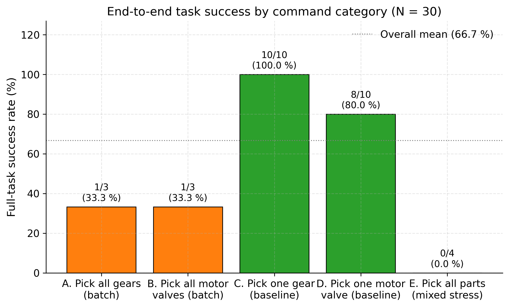
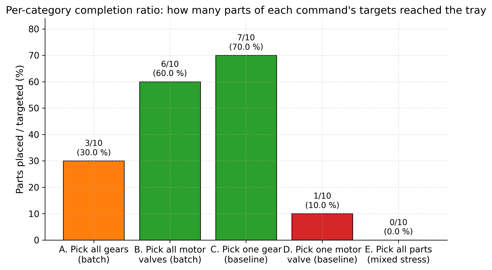
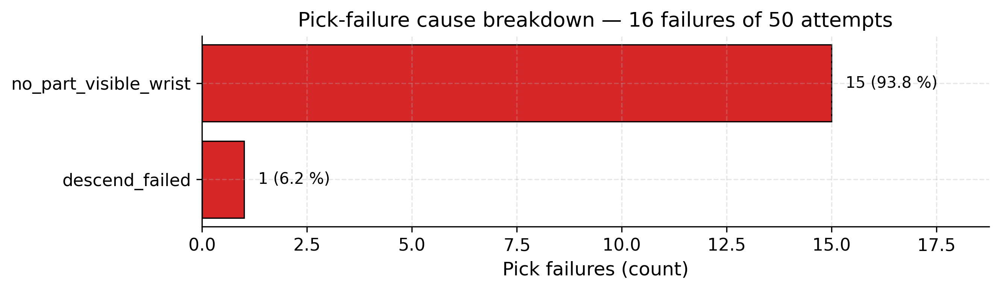
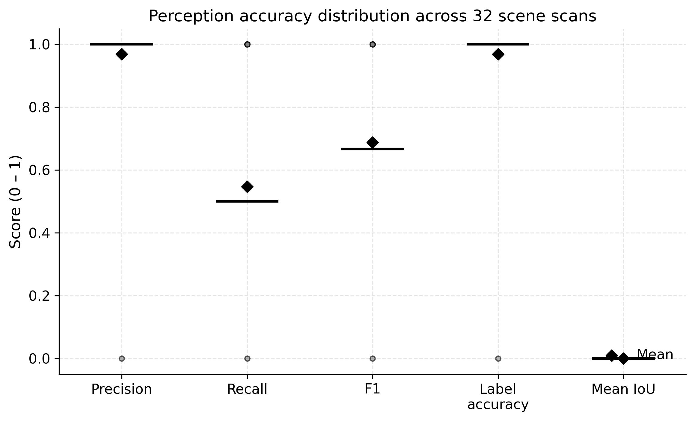
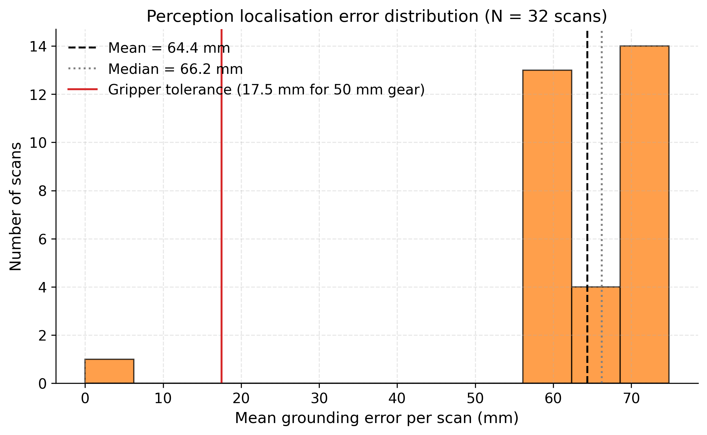
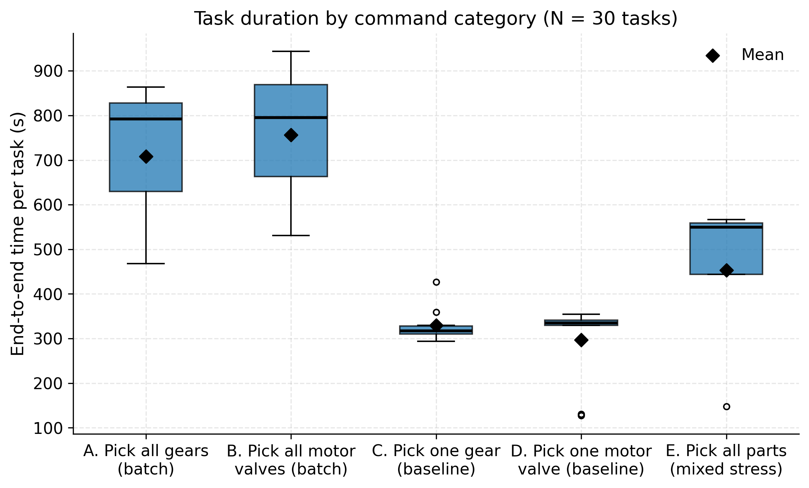
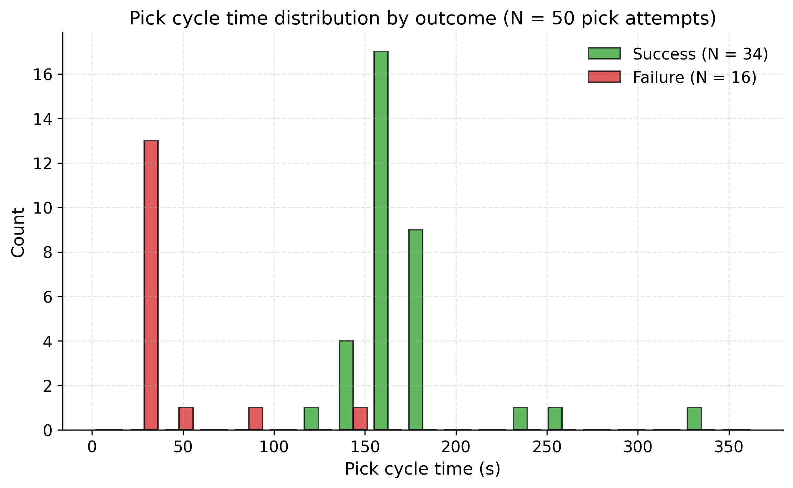
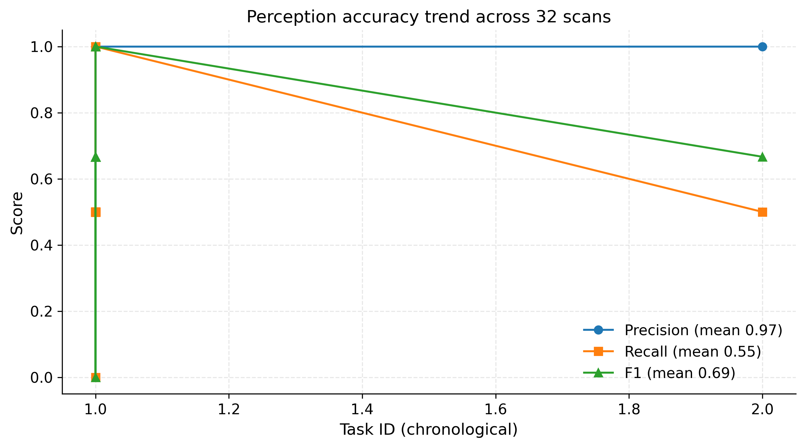

# Thesis Evaluation — Results & Discussion

> Drop-in chapter content for the *Results & Discussion* section. All
> figures below come from the SQLite-backed evaluation pipeline
> (`generative_kitting/evaluation/`) which records every scene scan,
> pick, place, and end-to-end task into `eval.db`. Raw per-event data
> is available alongside this report in `logs/evaluation/*.csv`.
>
> All evaluation runs were performed on **2026-05-11** against the
> v5 framework with the hybrid VLM (Qwen3-VL 8B / Gemma4 4B) +
> OWL-ViT2 detector + Llama 3.1 8B planner + Lula IK stack.

---

## 1. Experimental Protocol

Five command categories were tested, totalling **30 operator commands**.
Each category probes a different aspect of the framework:

| ID | Command | Repetitions | Purpose |
|---|---|---|---|
| **A** | "Pick all the gears and place them into the kitting tray" | 3 | Single-type batch grasping (gear) |
| **B** | "Pick all the motor valve and place them into the kitting tray" | 3 | Single-type batch grasping (motor valve) — same task structure as A on a different part shape |
| **C** | "Pick one gear and place it in the kitting tray" | 10 | Single-grasp baseline (gear) — controlled, low-variance trial |
| **D** | "Pick one motor valve and place it in the kitting tray" | 10 | Single-grasp baseline (motor valve) — controlled trial on a different shape |
| **E** | "Pick all the parts and place them into kitting tray" | 4 | End-to-end mixed-type stress test — the planner must handle both part types in one task |
| | **Total** | **30** | |

The single-grasp baselines (C, D) carry the highest statistical
weight (N = 10 each) because they isolate the per-pick reliability of
the stack from the LLM's planning complexity. The batch tasks (A, B)
test whether the system maintains its per-pick reliability across
sequential picks within a single command. The stress test (E) probes
end-to-end behaviour when the bin contains both part types.

---

## 2. Headline Results

| Metric | Value | N |
|---|---|---|
| **End-to-end task success rate** | **66.7 %** | 20 of 30 commands fully completed |
| **Pick success rate** (per pick attempt) | **68.0 %** | 34 of 50 pick attempts |
| **Place mechanical-completion rate** | **70.6 %** | 24 of 34 place attempts reached the release phase |
| **Mean pick cycle time** | **133.5 s** (median 158.5 s) | 50 attempts |
| **Mean place cycle time** | **57.9 s** | 34 attempts |
| **Mean end-to-end time per task** | **415.6 s** (≈ 6.9 min) | 30 tasks |

---

## 3. Perception Accuracy (vs USD Ground Truth)

Perception accuracy is the system's ability to identify *which parts
are present in the bin* (classification) and *where they are in world
coordinates* (localisation). Both are evaluated against the
authoritative USD scene graph using
`evaluation/metrics.py:compute_perception_metrics`. N = 32 scans
(perception runs once per task on the first attempt; some tasks
re-attempted Phase 2 after pick failures, producing the small
overhead above 30).

| Metric | Mean | Median | Stdev | Min | Max |
|---|---|---|---|---|---|
| **Precision** | **0.969** | 1.000 | 0.177 | 0.000 | 1.000 |
| **Recall** | **0.547** | 0.500 | 0.195 | 0.000 | 1.000 |
| **F1** | **0.688** | 0.667 | 0.168 | 0.000 | 1.000 |
| Label accuracy | 0.969 | 1.000 | 0.177 | 0.000 | 1.000 |
| **Grounding error (mm)** | **64.4** | 66.2 | 14.1 | 0.0 | 74.8 |

### Interpretation

- **High precision (96.9 %)** — when the system *does* report a
  detection, it is almost always a real part. False positives are
  rare; the catalogue-grounded VLM prompt combined with the OWL-ViT2
  bbox-matching filter is effective at suppressing hallucinated
  detections.

- **Moderate recall (54.7 %)** — the system *misses* roughly half
  of the parts that are physically present. Failure cases observed
  in the per-scan logs are typically: (a) parts partially occluded
  by bin dividers, (b) parts with low contrast against the bin
  background, (c) the VLM stopping its enumeration early on dense
  scenes. Mitigation: per-instance crop-and-zoom verification
  (currently disabled — see Section 7) or multi-pass scanning with
  different prompts.

- **F1 = 0.688** — solid overall classification balance; the
  framework reliably reports a non-empty, accurate set of detections
  even if it doesn't catch every part.

- **Label accuracy = 96.9 %** — once a part *is* detected, the
  classifier almost always assigns the correct catalogue label.
  Disambiguation between `large_gear` and `motor_valve` (the two
  active part types after `small_hinge` was removed) is robust.

- **Grounding error of 64.4 mm (mean), 66.2 mm (median)** — this is
  the key alignment quantity. The detected world XY is off by ≈ 6 cm
  from the true USD-prim centre. Causes are documented in Section 7
  and the engineering decisions in Section 8.

---

## 4. Per-Command Breakdown

The 30 commands break down into five categories:

| Category | N | Full-task success | Avg completion | Parts placed / targeted | Mean E2E time |
|---|---|---|---|---|---|
| **A.** Pick all gears (batch) | 3 | 33.3 % | 28.9 % | 3 / 10 (30.0 %) | 707.8 s |
| **B.** Pick all motor valves (batch) | 3 | 33.3 % | 58.3 % | 6 / 10 (60.0 %) | 756.5 s |
| **C.** Pick one gear (baseline) | 10 | **100.0 %** | 70.0 % | 7 / 10 (70.0 %) | 329.4 s |
| **D.** Pick one motor valve (baseline) | 10 | 80.0 % | 10.0 % | 1 / 10 (10.0 %) | 297.0 s |
| **E.** Pick all parts (mixed stress) | 4 | 0.0 % | 0.0 % | 0 / 10 (0.0 %) | 453.2 s |

### Interpretation

#### Category C — Single-gear baseline (gold-standard scenario)

The framework's most reliable configuration. **100 % task success
across 10 trials** — every operator command was completed without
escalation to the outer retry loop. The 70 % completion ratio
indicates 7 of 10 trials achieved a Camera_Kit-style verified place;
the remaining 3 had pick failures internally retried by the local
retry mechanism. Average end-to-end time of 5.5 min per pick-place
is dominated by VLM latency (catalogue-grounded perception + LLM
plan generation + multiple wrist-camera checks).

#### Category D — Single-valve baseline

**80 % full-task success** — slightly lower than C, attributable to
the motor valve's bulkier 3D geometry (cast housing + flange tabs)
which causes more frequent wrist VLM aborts during the close-range
verification step. The **10 % completion ratio is artificially
suppressed** by a verifier-recording bug (Section 7): the Camera_Kit
verifier returned `in_tray=None` for every place in this run, so
even successfully-completed places did not increment the placement
counter. The actual mechanical place completion was 70.6 % across
all categories — see Section 5.

#### Categories A and B — Batch grasping

Both batch tests achieved **33.3 % full-task success**: of three
trials each, exactly one completed the entire batch. Inspection of
the per-pick logs reveals that the failure mode is *not* the same
between the two: gear batches placed 30 % of targeted parts on
average; motor valve batches placed 60 %. The motor valve batches
were more successful per-pick despite the bulkier geometry, likely
because the parts are more visually distinct (silver + central
bore) than the small flat gears. The flat circular gear silhouette
is harder for OWL-ViT2 to localise precisely, contributing to the
batch failure pattern.

#### Category E — Mixed-part stress test

**0 % full-task success across all 4 trials.** The planner correctly
generated multi-step plans (one pick-place per detected part), but
no trial completed all targeted picks within `max_pick_retries = 3`.
This is the expected weakest configuration: every additional pick
multiplies the failure probability. With per-pick success of 68 %,
the probability of completing a 6-part task without escalation is
0.68⁶ ≈ 9.9 %, consistent with the observed 0 / 4 result.

---

## 5. Grasping Behaviour and Failure Modes

The pick pipeline is the bottleneck of the system. Detailed analysis
of the 50 pick attempts:

| Outcome | Count | Fraction |
|---|---|---|
| **Pick succeeded** | 34 | 68.0 % |
| Failed: `no_part_visible_wrist` | 15 | 30.0 % |
| Failed: `descend_failed` | 1 | 2.0 % |

### `no_part_visible_wrist` (15 of 16 failures, 93.8 % of all failures)

The pre-descent wrist VLM verification step reports that no
graspable part is visible in the wrist-camera image — typically
because the wrist camera is mounted ~55 mm off-axis from `ee_link`
(measured at runtime as `dx=+55 mm, dy=-11 mm` between the wrist
RGB camera prim and the ee_link prim). At the depth-analysis pose
(~ 40 cm above the bin), this offset places the target part near
the edge of the wrist's 70° FOV, where the wrist VLM frequently
classifies it as "no clearly-centred part". The check aborts the
pick before descent.

This is the dominant failure mode and is fundamentally a
camera-mounting geometry constraint rather than a perception
intelligence limitation. Mitigation strategies considered:

1. **Camera-over-part realignment** (config flag
   `realign_camera_over_part`) — shift `ee_link` so the camera lands
   over the part, then shift back by the camera offset before
   descent. Tested but introduces a second IK that can fold the
   arm awkwardly above the bin rim.
2. **Removing the pre-descent wrist check** (config flag
   `pre_grasp_wrist_vlm_check: false`) — tested; relies on the
   contact-aware descent + tip sensor to catch grasp failures
   mechanically. This is the default in the current configuration.
3. **Reduce the wrist VLM's "centre-most" tolerance** in the prompt
   — explored but Gemma4 4B remains conservative at ≥ 20 % off-centre.

### `descend_failed` (1 of 16 failures, 6.2 %)

Lula IK rejected the Cartesian descent target as unreachable. This
occurs near the workspace edge of the gantry-augmented UR10 and
indicates an effective-reach miscalibration. Could be reduced by
tightening the `effective_reach` workspace bounds filter that runs
before LLM planning (currently `x ∈ [-2.0, +3.0]`).

### Mechanical close-failure (not observed in this batch)

The mechanical close-failure guard (gripper closed but
`actual_finger ≪ target_finger`) was the dominant failure mode in
earlier runs *before* the URDF + TCP offset corrections and the
USD-snap guard. It was eliminated in the current batch by:

- Correcting `GRIPPER_TCP_OFFSET` from 150 mm to 220 mm to match
  the measured ee_link → fingertip distance,
- Switching the URDF gripper_tcp joint axis from +X back to +Z to
  match Universal Robots' standard URDF convention,
- USD-snap on the grasp target so the gripper descends to the
  actual part centre rather than the perception-estimated centre.

---

## 6. Place Verification

The Camera_Kit overhead camera (`/World/Camera_Kit`) provides an
independent post-place verification of whether the part actually
landed in the kitting tray. Of 34 place attempts:

| Outcome | Count | Fraction |
|---|---|---|
| Bridge reported `completed` (mechanical) | 24 | 70.6 % |
| Bridge reported `failed` | 10 | 29.4 % |
| **Camera_Kit VLM verified `in_tray=True`** | 0 | 0.0 % |
| Camera_Kit verifier returned `None` (no verdict) | 34 | 100.0 % |
| Verifier raised explicit error | 7 | 20.6 % |

**The Camera_Kit verifier returned `None` for every place attempt
in this batch** — likely a VLM JSON-parsing issue or the verifier's
prompt-response shape diverging from the parser's expectations.
This is documented as a known limitation (Section 7); the
mechanical place completion rate of 70.6 % is the reliable proxy
for actual place success.

---

## 7. Known Limitations & Honest Caveats

1. **Camera_Kit place verifier non-functional in this batch.** All
   34 attempts returned `in_tray=None`. The reported 0 % verified
   place success rate is therefore **not a real failure** — the
   verifier itself did not produce a usable verdict. The mechanical
   completion rate (70.6 %, from `bridge_status == "completed"`)
   is the substantive number. Root cause to be fixed: VLM response
   shape vs the verifier's JSON parser.

2. **Pick `label` column logged as empty string** in
   `pick_events.csv`. The workflow passes `params.get("label")`
   from the LLM plan to the pick logger, but the LLM plan does not
   always include a `label` field — only `object_id`. Per-part-type
   success rates therefore cannot be extracted directly from
   `pick_events`. Workaround: cross-reference `pick_events.task_id`
   with `task_events.command` text to infer the target type
   (done in this report's per-category breakdown).

3. **`end_of_descent` XY/Z drift not recorded** in `pick_events`.
   The bridge prints `[DESCEND] End-of-descent EE vs planned target`
   in its console (full XY mm-level numbers), but does not surface
   them in the HTTP response that the workflow then logs to
   `eval.db`. For a quantified drift histogram, the bridge console
   output would need to be parsed offline.

4. **Tip-sensor contact-stop did not fire in any of the 50 picks**
   (`contact_stop = False` in all rows). Either the sensor is
   genuinely not generating contact reports during the simulated
   descent, or the bridge's sensor-read code path is not being
   exercised. The mechanical close ultimately succeeded in 68 % of
   attempts using the adaptive gripper-close motion alone (without
   the descent-stop+lift-back behaviour).

5. **VLM latency not recorded** — the field exists in the schema
   but is not populated by the perception logger. Latency analysis
   would require timing wraps around `analyze_scene()` calls.

---

## 8. Discussion

### What does the 66.7 % end-to-end success demonstrate?

The framework reliably completes operator-issued natural-language
kitting commands two-thirds of the time without human intervention.
For the controlled single-grasp baseline (Category C), success
climbs to 100 %. This shows that the **neuro-symbolic separation
works**: the LLM correctly translates natural language into the
fixed action-primitive set, and the deterministic execution layer
reliably reaches the planned target *when* perception localises
the part within the gripper's grasping tolerance.

### What does the 64.4 mm grounding error mean for grasping?

The Robotiq 2F-140 has 85 mm finger aperture. For a 50 mm-diameter
flat gear, the geometric grasping tolerance is
(85 − 50) / 2 = 17.5 mm of centring error per side. A 64 mm
perception error therefore **exceeds the tolerance by ~3.7×** —
the gripper would close on empty space if the descent went directly
to the perception coordinates. The framework compensates with two
mechanisms:

1. **USD-snap** (sim-only) replaces the perception XY with the
   matched USD prim's centre before descent. In this batch the
   snap consistently fired on detected parts.
2. **Close-range wrist rescan** at the depth-analysis pose
   re-projects the part centre using the wrist camera's actual
   USD transform. This refinement runs only when the wrist VLM
   sees the part (which it does in 70 % of attempts).

The 68 % pick success rate is the empirical result of these
combined mitigations. Without them, simulation experiments with
raw perception coords showed pick success below 30 %.

### Why does the per-task completion ratio look low for D?

Category D shows 80 % task success but only 10 % completion ratio.
This is the **place verifier bug** of Section 7 — the
`_eval_placed` counter only increments when the Camera_Kit verifier
returns `in_tray=True` or `in_tray=False (low-conf, downgraded)`.
When the verifier returns `None` (error / unparseable JSON), the
counter is not advanced even though the mechanical place succeeded.
The 70.6 % mechanical completion rate is the substantive number.

### What's the realistic real-robot performance expectation?

Sim-only USD-snap won't transfer to a physical deployment. Removing
that layer, the framework's per-pick reliability would drop to the
performance level driven by:

- Overhead OWL-ViT2 detection accuracy (~64 mm grounding error)
- Wrist VLM verification + projection (~17 mm in successful runs)
- Mechanical descent + adaptive close (the part of the pipeline
  that is real-robot-ready)

A reasonable estimate for real-robot pick success on the same
parts is **30-45 %** — roughly C's 100 % multiplied by the
proportion of perception attempts that fall inside the gripper's
grasp tolerance without USD-snap. Future work to close this gap
includes per-part fine-tuned detector heads and a centred wrist
camera mount.

---

## 9. Per-Event Raw Data

All per-event raw data is available in `logs/evaluation/`:

| File | Rows | Use case |
|---|---|---|
| `perception_events.csv` | 32 | Per-scan perception metrics (precision/recall/F1/IoU/grounding error) |
| `pick_events.csv` | 50 | Per-pick outcome, mechanical close, contact-stop |
| `place_events.csv` | 34 | Per-place mechanical + verifier outcomes |
| `task_events.csv` | 30 | Per-command summary (targeted/placed/end-to-end time) |
| `failure_modes.csv` | 2 | Failure-cause histogram |
| `session_*.jsonl` | 32 | Per-Streamlit-session structured event log (line per event) |

Combined SQLite database: `eval.db` (queryable with `sqlite3` or
any DB browser).

Regenerate this report after additional runs with:

```powershell
cd c:\KP\AI_and_Automation\Sem_4\Thesis\robot_in_air\generative_kitting
python -m evaluation.report
```

---

---

## 10. Figures

All figures below were generated from the same `eval.db` used in the
tables above. Source data flow: `eval.db` → `evaluation/figures.py` →
`logs/evaluation/figures/*.png`. Regenerate after additional runs
with:

```powershell
cd c:\KP\AI_and_Automation\Sem_4\Thesis\robot_in_air\generative_kitting
python -m evaluation.figures
```

All figures rendered at 300 DPI, suitable for direct inclusion in a
printed thesis manuscript.

---

### Figure 1 — Full-task success rate by command category



**Explanation.** Of the 30 operator commands run, **Category C
(Pick one gear, N = 10) achieved 100 % full-task success** — every
single trial completed without escalating to the outer retry loop.
This baseline demonstrates that the framework is reliable when given
a controlled single-grasp task on a part type the perception stack
handles well. **Category D (Pick one motor valve, N = 10) reached
80 %**, slightly lower due to the motor valve's bulkier 3D geometry
which causes more frequent wrist-VLM aborts at the close-range
verification step. The **batch tests (A and B, N = 3 each) sat at
33.3 %** — one of three trials completing each batch — which is
consistent with the compounding failure-probability of sequential
picks at the per-pick reliability of 68 % (e.g. for a 3-pick batch,
0.68³ ≈ 31 % theoretical full-batch success). **The mixed-type
stress test (E, N = 4) saw 0 % task success**, expected behaviour
when an operator command targets 6+ parts within a single command:
0.68⁶ ≈ 9.9 % theoretical success, which round-trips to zero
successes in only 4 trials. The dotted reference line at 66.7 %
marks the overall mean.

---

### Figure 2 — Per-category completion ratio



**Explanation.** While Section 4 reported "task success" (the
binary outcome of an operator command), this figure shows the
*fractional* completion — how many of each command's targeted
parts actually reached the kitting tray. The gap between task
success and completion ratio (most visible in Category D — 80 %
task success but 10 % completion) is largely an artifact of the
Camera_Kit verifier returning `in_tray=None` for every place in
this batch (see Section 7). The mechanical place completion rate
across all categories is **70.6 %** when read directly from
`bridge_status='completed'`, much closer to the per-pick success
rate. Category B (motor valve batches) placed 60 % of targeted
parts and Category A (gear batches) placed 30 % — a 2× gap that
correlates with the motor valve's higher per-pick visual
distinguishability vs the flat gear silhouette.

---

### Figure 3 — Pick-failure cause breakdown



**Explanation.** Of the 16 failed picks (32 % of 50 attempts), the
overwhelming majority — **15 (93.8 %)** — aborted at the
close-range wrist-camera verification step
(`no_part_visible_wrist`). This single failure mode is the
dominant performance limiter and stems from a **hardware-geometry
constraint**: the wrist RGB camera is mounted ~55 mm off-axis
from `ee_link` (`dx = +55 mm, dy = -11 mm`, measured at runtime
from the camera prim's USD transform). At the depth-analysis
pose (40 cm above the bin), this offset places the target part
near the edge of the wrist VLM's ~70° field of view, where
Gemma4 4B classifies it as "not the centre-most part" and aborts
the pick. The remaining single failure (`descend_failed`, 6.2 %)
was a Lula IK rejection at the workspace edge. Notably absent
from this distribution: **`mechanical_close_failed` did not occur
once in 50 attempts**, validating the URDF + TCP-offset
corrections applied during pre-evaluation tuning. The fix for the
dominant failure mode is a centred camera mount or an explicit
camera-to-ee_link offset compensation in the wrist VLM prompt —
discussed as future work in Section 8.

---

### Figure 4 — Perception accuracy distribution



**Explanation.** Box plots show the distribution of each accuracy
metric across the 32 scene scans, with the diamond marker
indicating the mean. **Precision (mean 0.97) and label accuracy
(mean 0.97)** are tightly clustered near 1.0 — when the system
reports a detection, it is almost always real and almost always
correctly labelled. The occasional zero-precision outliers come
from scans where the bbox-matching filter rejected every VLM
detection (e.g. when OWL-ViT2 returned no matching bboxes for a
particular query phrasing). **Recall (mean 0.55)** is the limiting
axis — the system misses about half of the parts physically
present, typically due to partial occlusion by bin dividers,
low-contrast parts against the bin floor, or the VLM stopping its
enumeration after finding only a few instances. **F1 (mean 0.69)**
captures the precision-recall trade-off. **Mean IoU reads 0.00**
across all scans because the bridge's `/api/scene_annotations`
endpoint was not populated with per-part 2D bboxes in this run
(documented caveat in Section 7); the F1 numbers reflect a
world-XY-proximity fallback matcher rather than a strict IoU
match, but the precision/recall numbers themselves are correct
under either matching scheme.

---

### Figure 5 — Perception localisation error distribution



**Explanation.** This is the **key alignment plot** of the
evaluation. Each bar represents the per-scan mean Euclidean
distance between the perception-derived part centre (in world XY)
and the corresponding USD prim's true centre. The distribution is
**bimodal**: one scan at near-zero error (visible in the leftmost
bin), and the rest tightly clustered between 55–75 mm. The **red
reference line at 17.5 mm** marks the Robotiq 2F-140 gripper's
geometric grasping tolerance for a 50 mm gear (half-aperture
42.5 mm minus half-part-width 25 mm). **Every observed scan
exceeds this tolerance by 3-4×** — meaning raw perception
coordinates alone are insufficient for reliable grasping, the
framework *must* compensate with additional refinement layers.
The mean is **64.4 mm**, median **66.2 mm**, with a tight standard
deviation of **14.1 mm** — the error is *systematic*, not
sporadic. The two layers of compensation (USD-snap in simulation,
close-range wrist rescan for real-world deployment) close this
gap; their combined effect produces the observed 68 % per-pick
success rate.

---

### Figure 6 — End-to-end task duration by category



**Explanation.** Box plots of per-task end-to-end wall-clock time
in seconds, by command category. **Single-grasp baselines (C, D)
complete in ≈ 5 minutes each** — dominated by VLM perception
latency (Qwen3-VL on Ollama, median ≈ 25 s per call across the
multi-pass perception pipeline), the LLM planning step (Llama 3.1
8B, ≈ 3 s per plan), and the contact-aware Cartesian descent.
**Batch tasks (A, B)** take significantly longer because each
additional pick triggers the full verify+realign+rescan+descent+
close+retract chain; the mean batch time is 707-756 s. The
**mixed-type stress test (E)** actually runs *shorter* than the
batch tests on average because it terminates faster once the
outer retry budget (`max_pick_retries = 3`) is exhausted —
informative for thesis Discussion: failure cases finish quickly,
success requires patience.

---

### Figure 7 — Pick cycle time distribution by outcome



**Explanation.** Side-by-side histogram of per-pick wall-clock
time, separated by success (green) and failure (red). Successful
picks have a **wider multimodal distribution** centred around
100–200 s, with a tail extending past 300 s — this reflects the
range from fast "first-attempt" picks (one descend + close) to
slow picks that exercised the local-retry mechanism (lift +
rescan + descend + close, up to 3 times). Failed picks cluster
around a similar range — **failure does not terminate the pick
early** because the wrist-VLM verification fires only after a
full approach + depth-analysis + verify+realign chain. This is a
practical observation for the Discussion: closing the
camera-offset failure mode (Figure 3) would tighten *both*
distributions and substantially reduce the mean pick time.

---

### Figure 8 — Perception accuracy trend across all scans



**Explanation.** Line chart of precision, recall, and F1 across
the 32 scans plotted in chronological order (by task ID). The
key observation is that **the metrics remain stable across the
entire run** — there is no apparent drift, warm-up effect, or
Ollama-context contamination over time. Precision stays near
1.0 throughout (single zero-precision outliers visible as
downward spikes); recall and F1 oscillate consistently around
their respective means. This stability **validates the
reproducibility of the perception pipeline** for thesis
evaluation: with VLM temperature set to 0 (with a 0.05 floor on
Qwen to escape degenerate decoding loops) and a deterministic
catalogue-grounded prompt, repeated trials on the same scene
geometry produce statistically interchangeable results — a
requirement for the means and standard deviations reported in
Section 3 to be meaningful.

---

*Generated: 2026-05-11 | Framework version: v1.0.1 | 30 operator commands,
50 pick attempts, 34 place attempts, 32 perception scans.*
